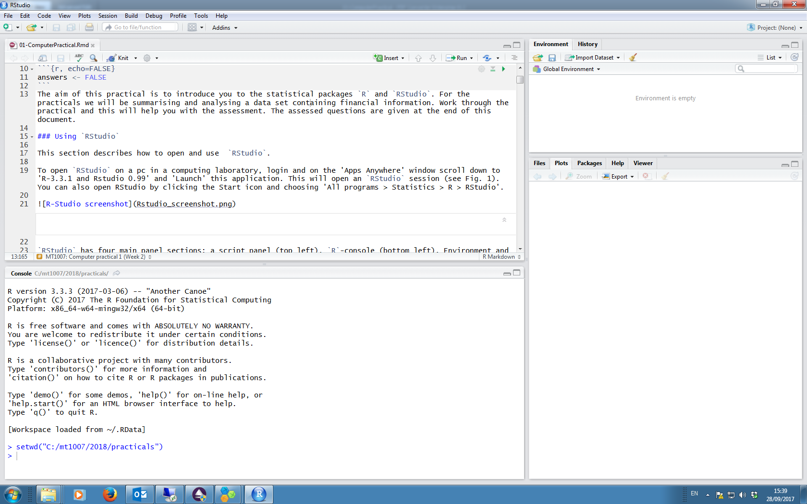

# 1.1 R basics

```{r setup, include=FALSE}
knitr::opts_chunk$set(echo = TRUE)

# Specify whether answers are shown 
#answer <- TRUE
answer <- FALSE
```

```{r, echo=F}
### Set seed so that random values are always the same!
set.seed(321)
```

## Introduction

This tutorial is the first in a series that were created as an introduction for those wishing to undertake distance sampling and related methods in R (R Core Team, 2017). The basics of R and RStudio are explored in this tutorial. Data are generated which can be thought of as a set of perpendicular distances collected from a track line and basic R commands are used to summarise and analysis it. 

This practical is divided into three; the first part is a basic introduction to `R` and `RStudio`, the second part is an introduction to R commands and the final part is an introduction to the distance sampling package. 

Throughout these practicals, `R` commands are shown in `courier font` and text in \textit{italics} which starts with a hash is a comment, for example

```{r, echo=T}
# This is an example of a comment 
```

A glossary is provided as a quick reference to some of the terms and special characters used in R.  

## Objectives of this practical

1. Introduction to `R` and `RStudio`. 

2. Using basic functions to summarise data.

3. Displaying data using histograms.

4. Performing basic calculations.

5. Using the distance sampling package to fit a detection function model. 

## Introduction to `RStudio` 

`RStudio` is a graphical user interface (GUI) to `R`; a major advantage of using `RStudio` is that it makes it easy to type `R` code into a script window which can be sent to the `R` command line to be executed and can also be saved (and hence retrieved). This section describes how to open and use the user-interface `RStudio`.

Check that `RStudio` and `R` have been installed on your computer; for this course we are using R version 3.5.1. When you open an `RStudio` session, the window will likely be similar to that shown in Figure 1. 



`RStudio` has four main panel sections; 

+ a script panel (top left), 

+ `R`-console (bottom left), 

+ Environment and History panel (top right) and 

+ a panel for Files, Plots, Packages and Help (bottom right).

If you can only see three panels, go to 'File > New File > R Script' to open a script panel. 

The script panel is used for writing `R` commands and comments describing the code to help you remember what the code does and why. The script can be saved and revisited at a later date; this is useful if writing a lot of code. The saved script file has a suffix 'xxx.Rmd', where `xxx` is a name of your choosing.  

Directly below the script panel is the `R` console window. `R` is the program that performs the analysis and executes your calculations. There are several options for executing code:

+ to run code from your script window, move the cursor to the line of code to be run and click the 'Run' button in the top right of the script window, 

+ or use keyboard shortcuts for Windows = Ctrl+Enter, for Mac/Linux = command+enter, 

+ copy the commands from the script panel and paste them into the `R` console panel at the `>` symbol, 

+ type commands directly into the console panel at the `>` symbol.  

The top right panel contains two tabs, Environment and History. The Environment tab shows all the objects and functions that have been imported and created in the `R` workspace. Upon exiting `RStudio`, the `R` workspace can be saved and then retrieved at a later date. An `R` object could be data that has been imported into `R` or objects created within `R` during an analysis. Also, if you create a function (a collection of commands) during your work session, these will also be listed on the Environment tab. The History tab shows all of the `R` code that has been run during the session; this is useful if you want to repeat or check a command.

In the bottom right panel there is the Packages tab; `R` packages are collections of functions which provide tools required to perform particular tasks. For the majority of the practicals for this course, additional packages will not have to be loaded. The Plots tab displays plots produced during the 'R' session. There is also a tab displaying details associated with in-built `R` functions; the help tab is very useful (see below). Finally, there is a Files tab; this tab lists files available in a particular (i.e. working) directory. The user can point `R` to a particular directory; this is called the working directory (more on this later). 

## The help function

There is a help facility in `R` which provides details about functions and packages. For example, to learn about the function `round` and what arguments it requires, type the following at the `>` in the console tab:

```{r, echo=TRUE, eval=FALSE}
help(round)
```

or alternatively,

```{r, echo=TRUE, eval=FALSE}
?round
```

The description of the function will appear on the Help tab (bottom right). Help is available for any in-built function.

## Generating some data

To get started, we will generate some data, pretending it is a set of perpendicular distances, and analyse it using basic commands. Below is a command to generate some data - this is fairly complicated but, for now, just copy and paste, or type, the command into the console window. 

```{r, echo=TRUE, eval=TRUE}
# Generate values from a normal distribution
dists <- rnorm(n=50, mean=0, sd=3)
```

At the moment, the syntax of this command can be ignored and will be explained as you work through the practical, nevertheless, what has this command done? It has: 

+ generated 50 random values from a Normal distribution (using the `rnorm` function) that has a mean of 0 and standard deviation of 3 (i.e. $N(\mu=0,  \sigma^2=3^2)$) 

+ stored the values in an object called `dists`.

The reason to store the values is so we can use them during this practical. We can think of these data as perpendicular distances from a transect centre line; since the mean of the numbers is 0, then some values will be negative (distances on the left of the centre line) and some will be positive (distances on the right). The numbers are generated randomly and so each time this command is executed, the numbers will be different; therefore, the set of values you generate will not be exactly the same as shown here.   

Having generated some data, the first thing to do is summarise and plot it.

## Summarising data

Typing the name of an object (in this case `dists`) will list the object on the screen i.e.

\color{blue}
```{r, echo=TRUE, eval=answer}
# Display the numbers in object dists
dists
```
\color{black}

Listing all the data is not very helpful, especially if there is a lot of data, but there are ways to display a subset of it. 

Display the first six values:

\color{blue}
```{r, echo=TRUE, eval=answer}
head(dists)
```
\color{black}

Another way to do display the first six values is to select which values to display, for example in the command below the second to eighth value, inclusive,  will be displayed, 

\color{blue}
```{r, echo=TRUE, eval=answer}
dists[2:8]
```
\color{black}

Listing all (or a few) of the numbers is helpful to see what it looks like but is not very helpful to get an overall picture and so we can use in-built `R` functions to help summarise it. Mostly, the function names are fairly intuitive:

\color{blue}
```{r, echo=TRUE, eval=answer}
mean(dists)
```
\color{black}

The mean should be zero, or very close to zero, since we specified a mean of zero to generate the data. Other useful functions are given below. 

\color{blue}
```{r, echo=TRUE, eval=answer}
# Minimum value (remember negative values are on the left of the trackline)
min(dists)
```
\color{black}

\color{blue}
```{r, echo=TRUE, eval=answer}
# Maximum value (positive values on the right of the trackline)
max(dists)
```
\color{black}

All the above information, and more, is provided in one command as follows:

\color{blue}
```{r, echo=TRUE, eval=answer}
summary(dists)
```
\color{black}

## Histograms

A key component of distance sampling is the histogram and we can plot our data using the `hist` function:

```{r, echo=TRUE, eval=answer, fig.height=3.5, fig.width=3.5}
# Plot a histogram
hist(dists)
```

Functions often have arguments which are specified by default and hence do not need to be specified by the user, unless the user wishes to change the default values. For example, the number of intervals in a histogram can be changed using the `breaks` argument (see command below). 

Note if we provide a number of intervals for the `breaks` argument, it doesn't always give the specified number of intervals - it works out useful/pretty intervals. Later in the practical we will specify the bin intervals. 

We can add a vertical (`v=`), red line to the histogram to indicate the transect centre line:

```{r, echo=TRUE, eval=answer, fig.height=3.5, fig.width=3.5}
# Plot a histogram with more intervals (but not always the number specified)
hist(dists, breaks=15)

# Add a centre line
abline(v=0, col="red")
```

In distance sampling, the left and right of the centre line are not differentiated and so to continue we want to ignore the sign of the values and convert negative values to positive values. The command below does this:

```{r, echo=TRUE, fig.height=3.5, fig.width=3.5}
posdists <- abs(dists)
```

The command can be broken down as follows

+ `abs` is a function which takes the absolute value of an object, in this case, it takes the absolute values of `dists`

+ `<-` is the assignment symbol which assigns values on the right hand side (i.e. absolute values of `dists`) to the object named on the left hand side (i.e. `posdists`). 

Plot a histogram of the new object and also specify a label for the $x$-axis using the `xlab` argument:

```{r, echo=TRUE, eval=answer, fig.height=3.5, fig.width=3.5}
# Plot a histogram of the new object
hist(posdists, xlab="Distance")
```

To specify the bin intervals, first we create the required intervals by generating a sequence of numbers (i.e. 0, 0.5, 1, ..., 8) and then using them in the `hist` command:

```{r, echo=TRUE, eval=answer, fig.height=3.5, fig.width=3.5}
# Create break points for bin intervals
setbrks <- seq(from=0, to=8, by=0.5)
# Histogram of distances with set bin intervals
hist(posdists, breaks=setbrks, xlab="Distance")
```

## R as a calculator

R is a powerful calculator and we will use some of the available functions to estimate the probability of detection for our pretend distance sampling data. 

A naive estimate of the probability of detection, $\hat p$, can be obtained from the number seen in the transect strip ($n$) divided the number of animals in the strip ($N$, i.e. the animals we should have seen if we had perfect detectability),

$$ \hat p = \frac {n} {N} $$
We know what $n$ is, this is just the number of values we generated (i.e. $n$=50) but let's check with the `length` function and then assign it to a new object `n`:

```{r, echo=T, eval=answer}
# Check number of observations
length(dists)
```

```{r, echo=T, eval=T}
# Assign n
n <- length(dists)
```

\color{blue}
```{r, echo=F, eval=answer}
cat('The number of observations, n = ',n)
```
\color{black}

The parameter $N$ can be obtained using the histogram as shown below; read off the maximum frequency (say it is 9) and then multiply this by the number of possible intervals, including intervals where no distances were recorded - in the example below, the number of intervals is 16. Note that your distances will be different to the one shown in this document and so use the values relevant to your data. 

```{r, echo=F, fig.height=3.5, fig.width=3.5}
# Illustrate the total number
setbrks <- seq(from=0, to=8, by=0.5)
temp <- hist(posdists, breaks=setbrks, plot=F)
maxy <- max(temp$counts)
maxx <- max(temp$breaks)
hist(posdists, setbrks, density=5, xlab="Distance", main="")
abline(v=8, col=4, lwd=2)
abline(h=maxy, col=4, lwd=2)
```

```{r, echo=T}
# Total number of animals in the strip
N <- 9 * 16
```

Now, estimate the probability of detection:

```{r, echo=T}
# Estimate probability of detection
phat <- n/N
```
\color{blue}
```{r, echo=F, eval=answer}
cat('Estimated probability of detection is ',format(phat),'.')
```
\color{black}

Make a note of your estimate; we will compare this with an estimate obtained by fitting a detection function model. 

## Data selection

Selecting a subset of data is a frequent data manipulation that is required and as shown previously, square brackets (i.e. `[]`) are frequently used. In a distance sampling context, we may want to exclude distances in the right hand tail of the distribution.

In the command below, `truncdists` is created by selecting only distances that are less than or equal to 6 (i.e. `<= 6`). 

```{r, echo=T}
# Truncate distances at 6
truncdists <- posdists[posdists <= 6]
```

How does this affect the probability of detection? Note that your $N$ will also change. 

\color{blue}
```{r, echo=F, eval=answer, fig.width=3.5, fig.width=3.5}
cat('truncn <- length(truncdists)','\n\n')
#  cat('truncn','\n')

# Number of objects seen within truncation distance
truncn <- length(truncdists)
cat('The number of distances <=6 is ',truncn,'\n')
# How many objects if detection was certain
setbrks <- seq(0,6,0.5)
cat('hist(truncdists, breaks=seq(0, 6, 0.5), xlab="Distance", main="")','\n')
temp <- hist(truncdists, breaks=setbrks, plot=F)
maxy <- max(temp$counts)
maxx <- 6
hist(truncdists, breaks=setbrks, density=5, xlab="Distance", main="")
abline(v=maxx, col=4, lwd=2)
abline(h=maxy, col=4, lwd=2)  
truncN <- 9 * 12
cat('truncN <- 9 * 12','\n')
# Probability of detection
cat('truncp <- truncn/truncN','\n')
truncp <- truncn/truncN
cat('The prob. of detection with truncation is ',format(truncp),'.')
```
\color{black}

## Using `Distance` to fit a detection function model

Above we have calculated a naive estimate of the detection probability, however, we can use the `Distance` package (Miller 2017) to obtain a more robust estimate. 

There are hundreds of R packages and so for efficiency the more specialised packages are not installed as standard when R is downloaded onto your computer. To check whether the `Distance` package is installed on your laptop, click on the 'Packages' tab (lower right pane) and see if it is listed. If so, then either click in the tick box or load it using the command

```{r, echo=TRUE, message=FALSE}
# Load R library for distance sampling
library(Distance)
```

If it is not listed, then it can easily be downloaded using the 'Install' tool. Note that each time you start a new R session and wish to use `Distance`, you will need to load it. 

The function `ds` fits a detection function and calculates abundance from both line or point transects. In this example, we don't have any areas required to calculate density and abundance and just want to estimate the probability of detection. The distances were generated from a Normal distribution and so a half-normal key function is specified (with the argument (`key="hn"`) with no adjustment terms (`adjustment=NULL`). 

```{r, echo=TRUE, eval=FALSE}
# Fit HN model, no adjustments terms
ds(posdists, key="hn", adjustment=NULL)
```
If we want to save the output so that we can interrogate it later, then we can assign the output to an object (`dsmodel`) as follows (the `quiet=TRUE` suppresses any message being printed):

```{r, echo=TRUE, eval=answer, warning=F, message=F}
# Fit a half-normal detection function
dsmodel <- ds(posdists, key="hn", adjustment=NULL, quiet=TRUE)
```

To examine the detection function, use the `summary` function. The `summary` function is a generic function and selects a relevant 'summary' based on the type of the object, in this case a distance sampling model object. 

\color{blue}
```{r, echo=TRUE, eval=answer}
# Summary of detection function
summary(dsmodel)
```
\color{black}

Was your crude estimate for $p$ close to the model estimate? 

The function `plot` is a generic function which can be used to plot the detection function:

```{r, echo=TRUE, eval=answer, fig.height=3.5, fig.width=3.5}
# Plot detection function
plot(dsmodel)
```

To truncate the distances, then the `truncation` argument in `ds` can be used:

```{r, echo=TRUE, eval=answer, message=F }
# Fit HN model with truncation at 6
dstrunc <- ds(posdists, key="hn", adjustment=NULL, truncation=6)
```

```{r, echo=TRUE, eval=FALSE}
# Summary of model
summary(dstrunc)
```

\color{blue}
```{r, echo=F, eval=answer, message=F, fig.height=3.5, fig.width=3.5}
# Summary of model and plot
summary(dstrunc)
plot(dstrunc)
```
\color{black}

Is this similar to your crude estimate when you used truncation? 

In the next practical, we will use data from an actual survey. 

### References

Miller DL (2017). Distance: Distance Sampling Detection Function and Abundance Estimation. R package version 0.9.7. https://CRAN.R-project.org/package=Distance

R Core Team (2017) R: A language and environment for statistical computing. R Foundation for Statistical Computing, Vienna, Austria. URL https://www.R-project.org/.